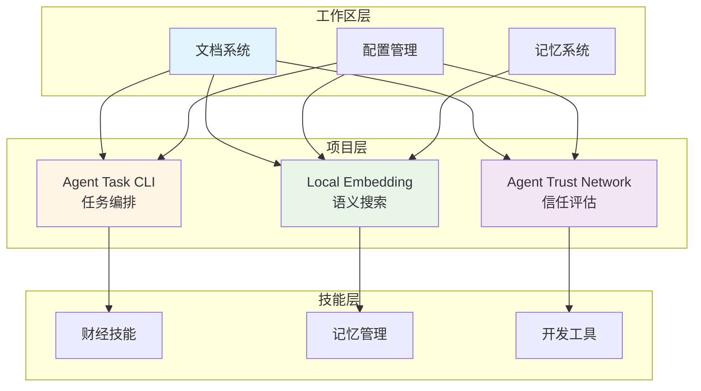
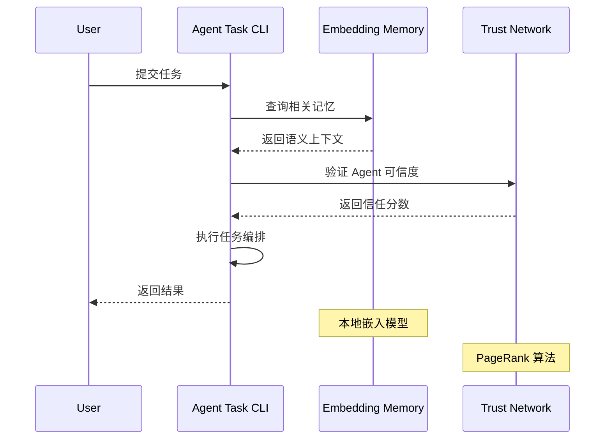
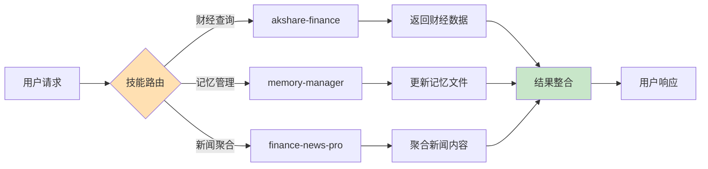

# OpenClaw Workspace

<div align="center">
  
  
  
  
</div>

> 🤖 **一个集成了 AI Agent 工具、技能和实验项目的工作区**

## 🎯 概述

这是一个为 AI Agent 开发设计的工作区，包含：
- 🛠️ **核心工具** - 项目管理、任务编排、记忆搜索
- 🤖 **OpenClaw 技能** - 可直接使用的技能包
- 🧪 **实验项目** - 探索 AI Agent 前沿技术
- 📚 **知识库** - 最佳实践和学习资源

## 📁 工作区结构

```
.openclaw/workspace/
├── 📚 文档
│   ├── README.md              # 你正在看的
│   ├── GETTING-STARTED.md     # 新手指南
│   ├── API-REFERENCE.md       # API 索引
│   ├── docs/DOCUMENTATION-GUIDE.md # 文档维护指南
│   └── QUICK-REFERENCE.md     # 快速参考
│
├── 🛠️ 项目 (projects/)
│   ├── agent-task-cli/        # ⭐ 多 Agent 任务编排 CLI
│   ├── agent-memory-service/  # Agent 记忆服务
│   ├── agent-memory-graph/    # Agent 记忆图谱
│   ├── agent-log/             # Agent 日志系统
│   ├── context-forge/         # AI 上下文文件生成
│   ├── mission-control/       # Agent 监控仪表板
│   └── prompt-mgr/            # Prompt 管理系统
│
├── 🤖 技能 (skills/)
│   ├── akshare-finance/       # 财经数据接口
│   ├── finance-news-pro/      # 财经新闻聚合
│   ├── memory-manager/        # 记忆管理
│   └── ...                    # 更多技能
│
├── 🧪 实验 (experiments/)
│   ├── local-embedding-memory/   # ⭐ 语义搜索
│   ├── agent-trust-network/      # ⭐ 信任网络模拟
│   └── agent-workflow-viz/       # 工作流可视化
│
└── 📝 记忆 (memory/)
    ├── MEMORY.md              # 长期记忆
    ├── episodic/              # 事件记忆
    ├── semantic/              # 语义记忆
    └── procedural/            # 过程记忆
```

## 🏗️ 系统架构

### 整体架构图



### 数据流架构



### 技能调用流程



## 🚀 快速开始（5 分钟）

### 1. 选择你的路径

#### 🎓 初学者 - 学习 AI Agent 概念

```bash
# 1. 了解工作区
cat GETTING-STARTED.md

# 2. 探索记忆系统
cd skills/memory-manager
cat README.md

# 3. 运行第一个实验
cd ../../experiments/local-embedding-memory
pip install sentence-transformers numpy
python memory_embedder.py --index
python memory_embedder.py --search "AI Agent"
```

**时间:** 30-45 分钟
**学习:** AI Agent 基础、记忆架构、语义搜索

#### 🛠️ 开发者 - 使用工具提升效率

```bash
# 1. 安装 Agent Task CLI
cd projects/agent-task-cli
npm install
npm link

# 2. 查看可用模式
agent-task patterns

# 3. 运行第一个任务
cd examples
agent-task run work-crew.yaml --dry-run
```

**时间:** 15-20 分钟
**学习:** 多 Agent 编排、5 种模式（Work Crew/Supervisor/Pipeline/Council/Auto-Routing）

#### 🔬 实验者 - 探索前沿技术

```bash
# 1. 语义记忆搜索（带 Web UI）
cd experiments/local-embedding-memory
python web_ui.py --port 8080
# 打开 http://localhost:8080

# 2. 信任网络模拟
cd ../agent-trust-network
npm install
npm run demo
```

**时间:** 20-30 分钟
**学习:** 嵌入式搜索、去中心化信任、网络可视化

### 2. 深入学习

- **30 分钟教程**: `experiments/local-embedding-memory/TUTORIAL.md`
- **完整 API 参考**: `API-REFERENCE.md`
- **使用场景**: `GETTING-STARTED.md` 第 3 节

## ⭐ 核心项目

### 1. Agent Task CLI

**强大的多 Agent 任务编排工具**

```bash
# 安装
cd projects/agent-task-cli
npm install && npm link

# 使用
agent-task run task.yaml
agent-task monitor <task-id>
agent-task export <task-id> --format markdown
```

**特性:**
- 🎯 5 种编排模式
- 📊 实时监控
- 💾 JSON/Markdown 导出
- 🧪 109 个测试（80%+ 覆盖率）

**文档:** [README.md](projects/agent-task-cli/README.md) | [TUTORIAL.md](projects/agent-task-cli/TUTORIAL.md)

---

### 2. Local Embedding Memory

**本地语义搜索，无需 API**

```bash
# 索引记忆
python memory_embedder.py --index

# 搜索
python memory_embedder.py --search "项目决策"

# 对比模式（语义 vs 文本）
python memory_embedder.py --compare "AI 架构"

# Web UI
python web_ui.py --port 8080
```

**特性:**
- 🔍 语义搜索（Sentence Transformers）
- 💾 本地运行（无 API 调用）
- 📊 增量索引
- 🌐 Web UI

**文档:** [README.md](experiments/local-embedding-memory/README.md) | [TUTORIAL.md](experiments/local-embedding-memory/TUTORIAL.md)

---

### 3. Agent Trust Network

**去中心化信任网络模拟器**

```bash
# 运行演示
npm run demo

# 运行测试
npm test
```

**特性:**
- 🤝 PageRank 式信任传播
- 🎭 多种 Agent 行为（合作/中立/恶意/对抗）
- 📉 信任衰减机制
- 🎨 ASCII 网络可视化

**文档:** [README.md](experiments/agent-trust-network/README.md) | [TUTORIAL.md](experiments/agent-trust-network/TUTORIAL.md)

## 🎓 学习路径

### 初级（1-2 天）

- ✅ 阅读工作区文档（README + GETTING-STARTED）
- ✅ 理解记忆系统架构
- ✅ 运行 local-embedding-memory 实验
- ✅ 使用 agent-task-cli 基础功能

### 中级（3-5 天）

- ✅ 创建自定义 agent-task 任务
- ✅ 集成多个工具
- ✅ 运行 agent-trust-network 实验
- ✅ 探索财经数据技能

### 高级（1-2 周）

- ✅ 开发自定义 OpenClaw 技能
- ✅ 扩展 agent-task-cli 功能
- ✅ 实现自定义记忆系统
- ✅ 构建真实应用

## 📚 文档导航

### 核心文档

| 文档 | 用途 | 时间 |
|------|------|------|
| [README.md](README.md) | 工作区概览（你正在看） | 5 分钟 |
| [GETTING-STARTED.md](GETTING-STARTED.md) | 新手完整指南 | 20 分钟 |
| [API-REFERENCE.md](API-REFERENCE.md) | API 文档索引 | 参考 |
| [docs/DOCUMENTATION-GUIDE.md](docs/DOCUMENTATION-GUIDE.md) | 文档维护指南 | 参考 |

### 项目文档

| 项目 | 语言 | README | 教程 |
|------|------|--------|------|
| agent-task-cli | Node.js | [README](projects/agent-task-cli/README.md) | [TUTORIAL](projects/agent-task-cli/TUTORIAL.md) |
| agent-memory-service | Node.js | [README](projects/agent-memory-service/README.md) | [TUTORIAL](projects/agent-memory-service/TUTORIAL.md) |
| agent-memory-graph | Python | [README](projects/agent-memory-graph/README.md) | [TUTORIAL](projects/agent-memory-graph/TUTORIAL.md) |
| agent-log | Bash | [README](projects/agent-log/README.md) | [TUTORIAL](projects/agent-log/TUTORIAL.md) |
| context-forge | Python | [README](projects/context-forge/README.md) | [TUTORIAL](projects/TUTORIAL-context-forge.md) |
| mission-control | Node.js | [README](projects/mission-control/README.md) | [TUTORIAL](projects/mission-control/TUTORIAL.md) |
| prompt-mgr | Python | [README](projects/prompt-mgr/README.md) | [TUTORIAL](projects/prompt-mgr/docs/TUTORIAL.md) |

### 扩展项目文档

| 项目 | 语言 | README | 教程 |
|------|------|--------|------|
| edge-agent-dashboard | Node.js | [README](edge-agent-dashboard/README.md) | [TUTORIAL](edge-agent-dashboard/TUTORIAL.md) |
| edge-agent-micro | C/ESP32 | [README](edge-agent-micro/README.md) | [TUTORIAL](edge-agent-micro/TUTORIAL.md) |
| agent-framework-integration | Python | [README](agent-framework-integration/README.md) | [TUTORIAL](agent-framework-integration/TUTORIAL.md) |
| agent-trust-web | Node.js | [README](agent-trust-web/README.md) | [TUTORIAL](agent-trust-web/TUTORIAL.md) |
| catalyst-agent-mesh | Go | [README](catalyst-agent-mesh/README.md) | [TUTORIAL](catalyst-agent-mesh/TUTORIAL.md) |
| github-creative-project | Node.js | [README](github-creative-project/README.md) | [TUTORIAL](github-creative-project/TUTORIAL.md) |
| nano-agent | Python | [README](nano-agent/README.md) | [TUTORIAL](nano-agent/TUTORIAL.md) |
| better-ralph-core | Node.js | [README](better-ralph-core/README.md) | [TUTORIAL](better-ralph-core/TUTORIAL.md) |
| mcp-server | Node.js | [README](mcp-server/README.md) | [TUTORIAL](mcp-server/TUTORIAL.md) |

### 技能文档

| 技能 | 文档 | 功能 |
|------|------|------|
| akshare-finance | [README.md](skills/akshare-finance/README.md) | 财经数据 API |
| agent-orchestrator | [SKILL.md](skills/agent-orchestrator/SKILL.md) | 多 Agent 编排 (CrewAI/LangGraph) |
| andrej-karpathy-perspective | [SKILL.md](skills/andrej-karpathy-perspective/SKILL.md) | Karpathy 思维框架 |
| feifei-li-perspective | [SKILL.md](skills/feifei-li-perspective/SKILL.md) | 李飞飞思维框架 |
| finance-news-pro | [README.md](skills/finance-news-pro/README.md) | 财经新闻聚合 |
| hackernews | [README.md](skills/hackernews/README.md) | Hacker News 浏览搜索 |
| memory-manager | [README.md](skills/memory-manager/README.md) | 记忆管理 |
| nuwa-skill | [README.md](skills/nuwa-skill/README.md) | 人物 Skill 蒸馏生成 |
| tech-briefing | [README.md](skills/tech-briefing/README.md) | 每日技术简报 |
| better-ralph | [SKILL.md](skills/better-ralph/SKILL.md) | PRD 驱动自主编码 |
| ralph-autonomous-agent-loop | [SKILL.md](skills/ralph-autonomous-agent-loop/SKILL.md) | 自主 Agent 循环 |

## 💡 使用场景

### 📊 财经数据分析

```bash
# 安装技能
cd skills/akshare-finance
pip install akshare pandas

# 获取股票数据
python -c "import akshare as ak; print(ak.stock_zh_a_spot_em())"

# 聚合新闻
cd ../finance-news-pro
python fetch_news.py --source cls,wallstreet
```

### 🤖 多 Agent 协作

```bash
# 创建任务
cd projects/agent-task-cli
cat > my-task.yaml << EOF
name: "Research Project"
pattern: "work-crew"
agents:
  - name: "researcher"
    role: "Technical research"
  - name: "analyst"
    role: "Business analysis"
task: "Research AI Agent frameworks"
EOF

agent-task run my-task.yaml
```

### 🧠 AI 记忆增强

```bash
# 语义搜索记忆
cd experiments/local-embedding-memory
python memory_embedder.py --index
python memory_embedder.py --search "project decisions"
```

## 🛠️ 常用命令

### Agent Task CLI

```bash
agent-task run <file>           # 运行任务
agent-task list                 # 列出任务
agent-task monitor <task-id>    # 监控进度
agent-task export <task-id>     # 导出结果
agent-task patterns             # 查看模式
```

### Local Embedding Memory

```bash
python memory_embedder.py --index              # 索引
python memory_embedder.py --search "query"     # 搜索
python memory_embedder.py --compare "query"    # 对比
python web_ui.py --port 8080                   # Web UI
```

### Memory Manager

```bash
./init.sh                       # 初始化
./detect.sh                     # 检查压缩风险
./organize.sh                   # 组织文件
./search.sh <type> <query>      # 搜索
./stats.sh                      # 统计
```

## 🔧 故障排除

### 依赖安装失败

```bash
# Python
pip install -r requirements.txt --upgrade

# Node.js
npm install --force
```

### 命令未找到

```bash
# 确保 npm link
cd projects/agent-task-cli
npm link
which agent-task
```

### 权限错误

```bash
chmod +x skills/memory-manager/*.sh
```

## 🤝 贡献

想要改进这个工作区？

1. **改进文档** - 修复错误、添加示例
2. **报告问题** - 在 `memory/` 中记录
3. **添加技能** - 创建新的 OpenClaw 技能
4. **分享经验** - 在 `catalyst-research/exploration-notes/` 中记录

详见: [docs/DOCUMENTATION-GUIDE.md](docs/DOCUMENTATION-GUIDE.md)

## 📊 项目状态

| 项目 | 语言 | 状态 | 文档 |
|------|------|------|------|
| agent-task-cli | Node.js | ✅ 稳定 | ✅ README + 教程 |
| agent-memory-service | Python | ✅ 稳定 | ✅ README |
| agent-memory-graph | Python | ✅ 稳定 | ✅ README |
| agent-log | Bash | ✅ 稳定 | ✅ README + TUTORIAL |
| context-forge | Python | ✅ 稳定 | ✅ README + 教程 |
| mission-control | Node.js | 🚧 开发中 | ✅ README + 教程 |
| prompt-mgr | Python | ✅ 稳定 | ✅ README + 教程 + API |

## 📞 获取帮助

- **文档问题**: 查看对应的 README.md 或 TUTORIAL.md
- **工具使用**: 使用 `--help` 或查看 API 文档
- **概念理解**: 阅读 `catalyst-research/exploration-notes/`
- **Bug 报告**: 记录在 `memory/` 中

## 🎯 快速链接

- **新手入门**: [GETTING-STARTED.md](GETTING-STARTED.md)
- **API 参考**: [API-REFERENCE.md](API-REFERENCE.md)
- **文档维护**: [docs/DOCUMENTATION-GUIDE.md](docs/DOCUMENTATION-GUIDE.md)
- **快速参考**: [QUICK-REFERENCE.md](QUICK-REFERENCE.md)

## 📄 许可证

MIT License - 详见各项目的 LICENSE 文件

## 🙏 致谢

- OpenClaw 平台提供的开发环境
- 所有开源项目的贡献者
- AI Agent 社区的持续创新

---

<div align="center">
  <p><strong>🚀 开始你的 AI Agent 之旅</strong></p>
  <p>选择你的路径：🎓 <a href="GETTING-STARTED.md">学习</a> | 🛠️ <a href="projects/agent-task-cli/README.md">工具</a> | 🔬 <a href="experiments/">实验</a></p>
</div>

---

*最后更新: 2026-05-01*
*维护者: OpenClaw Workspace Team*
